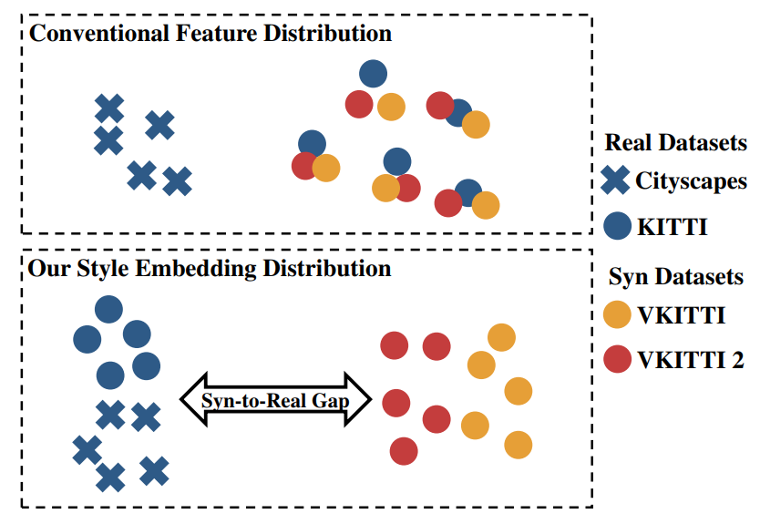
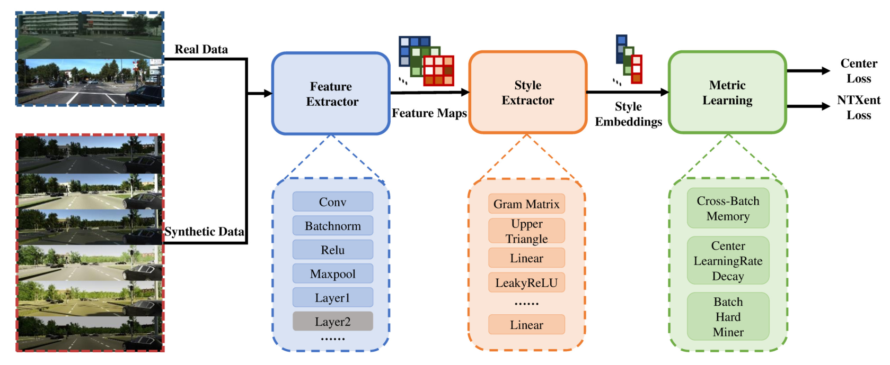
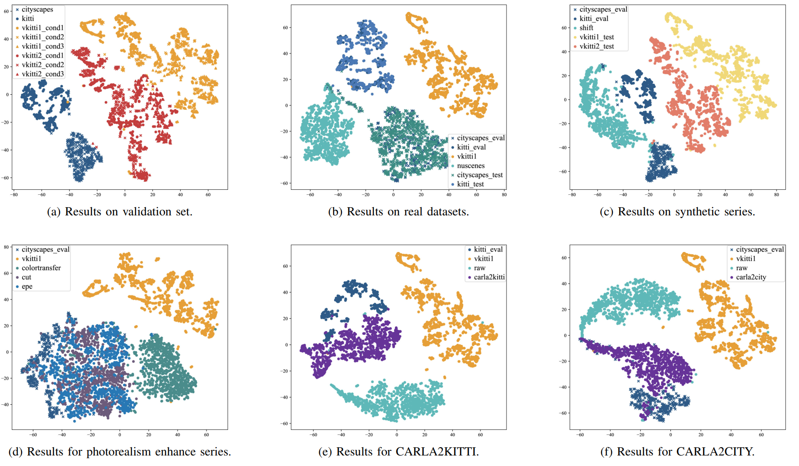

# A Style-Based Profiling Framework for Quantifying the Synthetic-to-Real Gap in Autonomous Driving Datasets

[](https://arxiv.org/abs/2510.10203)

🏆 **Accepted to IEEE IV 2026 - The IEEE Intelligent Vehicles Symposium (IV)**

<p align="center">
  
</p>


This repository contains the PyTorch implementation for the paper **"A Style-Based Profiling Framework for Quantifying the Synthetic-to-Real Gap in Autonomous Driving Datasets"**. The project learns style embeddings for autonomous driving image datasets and uses them to quantify how far synthetic datasets are from real-world datasets.

The core metric is **Style Embedding Distribution Discrepancy (SEDD)**:

- 📏 **SEDD1** measures the Euclidean distance between synthetic and real style centers.
- 📐 **SEDD2** measures distribution discrepancy with Maximum Mean Discrepancy (MMD).

SEDD functions as a proactive diagnostic tool within the data generation pipeline. It allows researchers to screen environmental parameters to minimize the distributional distance to the real domain before large-scale rendering and aids in model selection for domain adaptation by identifying which translation method yields the most realistic style. 

## 📌 Paper Abstract

Ensuring the reliability of autonomous driving perception systems requires extensive environment-based testing, yet real-world execution is often impractical. Synthetic datasets have therefore emerged as a promising alternative, offering advantages such as cost-effectiveness, bias free labeling, and controllable scenarios. However, the domain gap between synthetic and real-world datasets remains a major obstacle to model generalization. To address this challenge from a data-centric perspective, this paper introduces a profile extraction and discovery framework for characterizing the style profiles underlying both synthetic and real image datasets. We propose Style Embedding Distribution Discrepancy (SEDD) as a novel evaluation metric. Our framework combines Gram matrix-based style extraction with metric learning optimized for intra-class compactness and inter-class separation to extract style embeddings. Furthermore, we establish a benchmark using publicly available datasets. Extensive experiments demonstrate that SEDD aligns with human perception where traditional NR-IQA metrics fail. Specifically, it correctly identifies the superior fidelity of Virtual KITTI 2 over Virtual KITTI and quantifies the gap reduction achieved by  sim-to-real methods. This work provides a standardized proactive quality control paradigm that enables the systematic diagnosis of dataset deficiencies and guides the selection of optimal sim-to-real adaptation strategies, advancing future development of data-driven autonomous driving systems. 

<p align="center">
  
</p>


## ⚙️ Environment

Recommended environment:

- Python 3.9+
- PyTorch
- TorchVision
- NumPy
- SciPy
- Pillow
- scikit-learn
- pytorch-metric-learning


## 🚀 Training

Run:

```bash
python main.py --temperature 0.015 --lr 5e-5 --lambda 0.5
```

## 🧪 Train on Your Own Twin Dataset

Researchers with new one-to-one paired or twin datasets are encouraged to train their own SEDD model. The framework is especially suitable when synthetic images correspond to real scenes, cloned scenes, or controlled variants of the same driving scenario, because these pairs make it easier to separate content differences from style differences.

To adapt the project to a new dataset:

1. Organize the real and synthetic image folders with consistent scene or sequence correspondence.
2. Update the dataset paths and, if needed, extend `dataloader.py` or `dataloader_newdataset.py` for the new folder layout.
3. Run `main.py` with the desired temperature, learning rate, and center-loss weight.
4. Use the trained feature extractor and style extractor to compute SEDD for your own real-synthetic gap analysis.

## 📦 Provided Checkpoints

The repository includes trained weights:

```text
result_model/final/FeatureExtractor.pth
result_model/final/StyleExtractor.pth
```

These checkpoints correspond to the learned feature extractor and style extractor used for style embedding generation.

## 🖼️ Visualization Results

To generate the style embedding t-SNE scatter plots as shown in the paper, simply execute the visualization script:

```bash
python visstyleemb.py
```

This script extracts 64-dimensional style embeddings using the generated checkpoints and projects them into a 2D space map. The resulting visualization allows you to intuitively analyze the style gap between real and synthetic datasets.

<p align="center">
  
</p>


## 📝 Citation

If you use this code or the SEDD metric, please cite:

```bibtex
@misc{yao2026stylebasedprofilingframeworkquantifying,
      title={A Style-Based Profiling Framework for Quantifying the Synthetic-to-Real Gap in Autonomous Driving Datasets}, 
      author={Dingyi Yao and Xinyao Han and Ruibo Ming and Zhihang Song and Lihui Peng and Jianming Hu and Danya Yao and Yi Zhang},
      year={2026},
      eprint={2510.10203},
      archivePrefix={arXiv},
      primaryClass={cs.CV},
      url={https://arxiv.org/abs/2510.10203}, 
}
```
